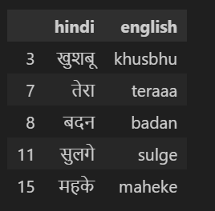
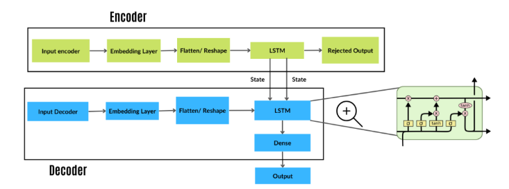
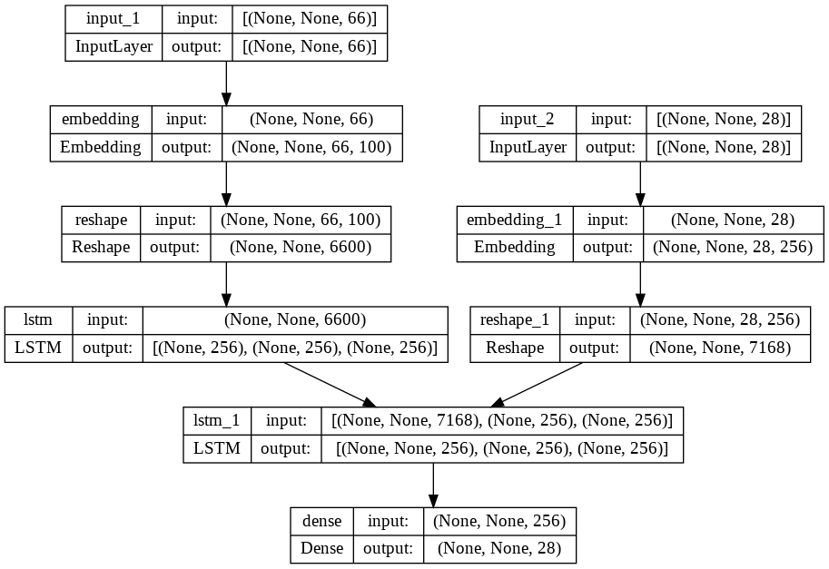
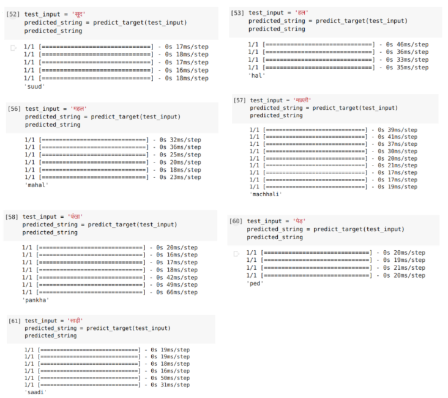

# Devanagari → Roman Transliteration (Hindi to English)
A **neural machine transliteration system** that converts words written in **Devanagari (Hindi script)** into their **Roman (English script)** equivalents using an **Encoder–Decoder architecture with LSTM cells**.  

## Abstract

Transliteration transfers **script and pronunciation** from one language to another. For Hindi, which contains complex tokens (half characters, bindus, chandrabindus), transliteration is challenging.  
This project investigates deep learning approaches for transliteration using a supervised dataset of Hindi–English word pairs. The system was trained and evaluated using error-rate metrics and compared across experiments.
With increasing globalisation, information access across language barriers
has become important. Given a source term, machine transliteration refers
to generating its phonetic equivalent in the target language. This is
important in many cross-language applications.

Transliteration is converting text from one language into another using a
pre-established mapping. When a user is conversant in a language but not
proficient in writing its script, this is helpful. India's lingua-franca is
Hindi. In India, it is the language that is written and spoken the most.
When pronouncing words and names in foreign languages, transliteration
is helpful. Only the letters or characters of the source language should be
changed into their equivalent letters in the target language. Contrary to
translation, which changes the spoken or written meanings of words or
texts in a source language into a target language, it does not render
meaning.

The model utilises an Encoder-Decoder Architecture to translate a word
from Devanagari script (Hindi) into Roman script (English). The
Devanagari input sequence is transformed into an encoded version of the
sequence by the network component known as the encoder network. The
encoded representation is then used by the decoder network to generate a
Roman script output sequence. Transliteration is helpful when dealing
with proper nouns. LSTM can be used to improve the precision of the
models by incorporating the previous outputs with current learnings.

---

## Problem Statement

- **Input:** Hindi word in Devanagari script.
- **Output:** Equivalent Romanized word.  
- **Goal:** Achieve accurate character-level transliteration to support multilingual tasks such as cross-lingual IR, named entity recognition, and code-mixed text processing.  
- **Challenge:** Multiple valid Roman spellings exist for the same Hindi word, making Word Error Rate high even if Character Error Rate is low.

---

## Dataset

- **Size:** 30,822 word pairs (Devanagari → Roman).  
- **Format:** CSV file with two columns (`Hindi_word`, `English_word`).  
- **Preprocessing:**  
  - Removed duplicates and null entries.  
  - Stripped whitespaces and standardized tokens.  
  - Added special start (`^`) and end (`$`) tokens to output sequences.  

---

## Methodology
- **Architecture:** Sequence-to-Sequence Encoder–Decoder with LSTM units.
  
- **Input shape:** (1, 18, 66) → 18 max Hindi characters, 66 unique tokens.  
- **Output shape:** (1, 23, 28) → 23 max English characters, 28 unique tokens.

- **Training setup:**  
  - Epochs: 500  
  - Batch size: 64  
  - Optimizer: RMSProp (lr = 0.001)  
  - Loss: Categorical Cross-Entropy  
  - Early stopping & learning rate scheduling to prevent overfitting.  

---

## Results
- **Word Error Rate (WER):** 65.85%  
- **Character Error Rate (CER):** 13.46%  

These results indicate that although many words differed slightly in spelling (`hansna` vs `hasna`), most predictions were phonetically correct.

---
📑 For a detailed explanation, see the **full Project report** .

## Future Work
- Extend model to **bidirectional transliteration** (Roman → Devanagari).  
- Explore **Transformer-based architectures** (IndicBERT, mBERT, etc.).  
- Improve handling of rare and longer words unseen during training.  
- Apply to **multilingual Indic transliteration** tasks.

Please reach out to **itsmealmas.ansari@gmail.com** for further Collaboration.

---

## Tools & Environment
- **Language:** Python 3.x  
- **Libraries:** TensorFlow/Keras, NumPy, Pandas, Matplotlib  
- **Platform:** Google Colab  

